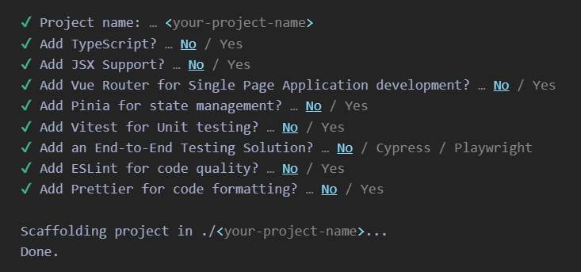

Step 1: Install node.js https://nodejs.org/en

Step 2: open `bash` and follow the commands
- `npm create vue@latest`
-  If you are unsure about an option, simply choose <b>No</b> by hitting enter for now.
- `cd (your-project-name)`
- `npm install`
- `npm run dev`

Step 3: Inside views, you can remove unwanted things from `HomeView.vue` and `AboutView.vue` start from basic template eg: 
```
<template>
    <main>
    <h1> About Page </h1>
  </main>
</template>
```
Step 4: 